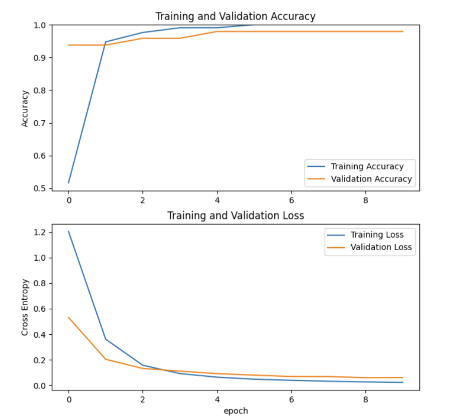

# vegetable_recognition
Recognize and classify vegetables in opencv and tensorflow. 

### Components
The project consists a machine learning implementation, a crawler scripts to collect data, label and split the data, 
and an extra script to further modify the image for tensorflow machine learning format.

### List all libraries used: 
Tensorflow for machine learning
Matplotlib for data training
OpenCV for the camera module

### Functionality & Designs
Smart object identification: the object identification supports items in all angles, multiple items of the same type, item in a near-clear bag or container. 
This means the user can drop an entire bag of objects on the platform and expect the correct result to be returned. This is enabled as well as collecting 
and labelling most of the data ourselves, so we can choose any angle/count for the best training result.

The design (or/and reference source), training and implementation of any machine learning use in the project
In order to have better and faster training results (and we don’t have gpu in training), we referenced on tensorflow 
and implemented a mobilenet v2 model with transfer learning. The design of the training process includes data-split, 
result evaluation, and final prediction. There is one file called split.py which splits four files of data 
[broccoli, cabbage, eggplant, carrot] into a training set and evaluation set with ratio 0.8 and 0.2. The training process is 
implemented in the document called mobileNetV2.py. We designed the batch size as 16, as this value is the intermediate of time 
cost in training, and the prediction accuracy. We split the training process into ten epochs, for each training process is 
within a logical time. Also, this document plots the training curve for the data in the evaluation part. In the 10th epochs, 
as we see the correct percentage 100% in the plotted learning curve, it is fair to say our model works in expectation.
	
### Training Result

